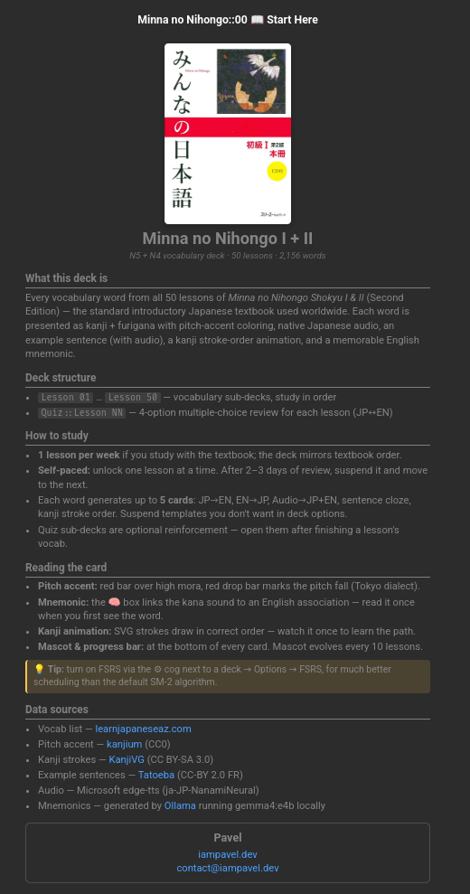
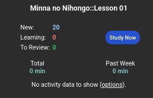
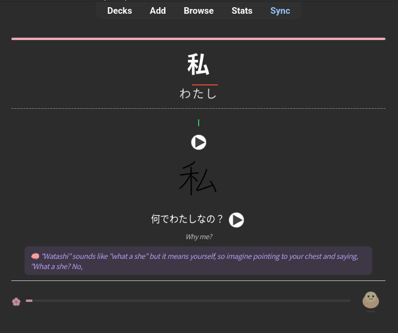

# mnn-vocab

Enriched **Minna no Nihongo** Anki deck generator. Produces a single `.apkg` with all 2,156 vocabulary words from lessons 1–50, plus:

- Native Japanese audio (edge-tts, NanamiNeural)
- Pitch-accent coloring (kanjium)
- Kanji stroke-order animations (KanjiVG)
- Example sentences with audio (Tatoeba)
- LLM-generated English mnemonics (local Ollama)
- 4-option multiple-choice quiz cards per lesson
- Per-lesson themes + evolving mascot

Final deck: ~55 MB, 2,156 vocab + 4,310 quiz + 1 info card.

**🌐 Browse online:** https://k1ng440.github.io/minna-no-nihongo-anki/

## Screenshots

<table>
  <tr>
    <td align="center"><br/><sub>Start Here info card</sub></td>
    <td align="center"><br/><sub>Per-lesson deck overview</sub></td>
    <td align="center"><br/><sub>Vocab card with pitch, kanji stroke, sentence, mnemonic, mascot</sub></td>
  </tr>
</table>

## Quick start

```bash
# 1. install
uv sync

# 2. configure
cp .env.example .env
# edit .env if running Ollama elsewhere or using a different model

# 3. fetch dependencies (one-time, ~50 MB)
uv run mnn fetch all

# 4. full pipeline
uv run mnn all
```

Output: `dist/MinnaNoNihongo_Vocab.apkg` — import into Anki.

## CLI

```
mnn doctor                  # sanity-check env, data, endpoints
mnn scrape                  # learnjapaneseaz → cache/lesson_*.json
mnn fetch [tatoeba|kanjivg|kanjium|all]
mnn clean [--fill-kanji]    # validate + fill missing kanji via jisho
mnn audio [words|sentences|all]
mnn enrich [pitch|kanji-svg|sentences|mnemonics|quiz|all]
mnn build                   # assemble dist/MinnaNoNihongo_Vocab.apkg
mnn all                     # full pipeline
mnn preview L:N             # render single card → out_preview.html
mnn web                     # static web UI → docs/ (for GitHub Pages)
mnn purge-cache --confirm   # nuke cache/
```

Global flags: `-v` verbose, `-q` quiet.

## Configuration (`.env`)

```
LLM_API_URL=http://localhost:11434     # Ollama local; use https://ollama.com/api for cloud
LLM_API_KEY=ollama                     # any value for local; bearer token for cloud
LLM_MODEL=gemma4:e4b                   # any OpenAI-compat model
LLM_CONCURRENCY=8
TTS_VOICE=ja-JP-NanamiNeural
TTS_CONCURRENCY=16
PIXABAY_API_KEY=                       # only needed if PIXABAY_ENABLED=1
PIXABAY_ENABLED=0                      # images dropped by default — Pixabay quality is poor for vocab
PARENT_DECK=Minna no Nihongo
```

## Pipeline stages

1. **scrape** — learnjapaneseaz.com → `cache/lesson_N.json`
2. **fetch** — Tatoeba sentences + KanjiVG SVGs + kanjium accents → `data/`
3. **clean** — validate scraped rows, manual overrides, optional jisho kanji fill → `cache/lesson_N.cleaned.json`
4. **enrich**
   - `pitch` → `cache/pitch.json` (310k entries)
   - `kanji-svg` → `svg/k_*.svg` + `cache/kanji_svg_map.json`
   - `sentences` → `cache/sentences/lesson_N.json` (~85% hit rate)
   - `mnemonics` → `cache/mnemonics/lesson_N.json` (~98% hit rate, depends on LLM)
   - `quiz` → `cache/quiz/lesson_N.json`
5. **audio** — edge-tts → `audio/`, `audio_sent/`
6. **build** — assemble `.apkg` from caches (no network)

Every stage is idempotent: caches are reused on re-run. Pass `--force` (where supported) or `mnn purge-cache --confirm` to start fresh.

## Web UI

```bash
uv run mnn web
```

Outputs `docs/` (~51 MB) — browsable static site with the same data as the deck.

**Live demo:** https://k1ng440.github.io/minna-no-nihongo-anki/

**Enable GitHub Pages from `/docs`:**
1. Push to GitHub.
2. Settings → Pages → Source: `Deploy from a branch` → Branch: `main` `/docs` → Save.
3. Site goes live at `https://<user>.github.io/<repo>/`.

Features:
- Browse all 2,156 words by lesson (sidebar nav)
- Full-text search across kanji / kana / meaning / mnemonic
- Filters: has-kanji, has-sentence, has-mnemonic, hide-learned
- Click any card to expand: pitch-colored kana, example sentence, kanji stroke SVG, LLM mnemonic, inline audio playback
- Mark cards "learned" → persists in browser `localStorage`
- Light/dark theme toggle (defaults to `prefers-color-scheme`)
- Mobile-friendly (responsive grid + hamburger menu)

## Project layout

```
src/mnn/
├── cli.py              # Typer entry
├── config.py           # .env → Settings
├── paths.py            # canonical dirs
├── log.py              # rich logging
├── sources/            # network I/O (Tatoeba, KanjiVG, kanjium, jisho, llm, learnjapaneseaz, pixabay)
├── enrich/             # transforms (clean, pitch, kanji_svg, sentences, audio, mnemonics, quiz, fill_kanji)
├── deck/               # apkg assembly (models, templates, themes, info, builder)
├── commands/           # CLI command runners
├── util/               # hashing, io, progress
└── verify.py           # mnn preview
```

## Author

Asaduzzaman Pavel · [iampavel.dev](https://iampavel.dev) · [contact@iampavel.dev](mailto:contact@iampavel.dev)

## License

- **Source code** (`src/mnn/`, configs): MIT — see [`LICENSE`](LICENSE)
- **Generated deck + bundled media**: CC BY-SA 4.0 (inherited from KanjiVG + JMdict)

Third-party data sources, licenses, and obligations are documented in [`ATTRIBUTIONS.md`](ATTRIBUTIONS.md).
